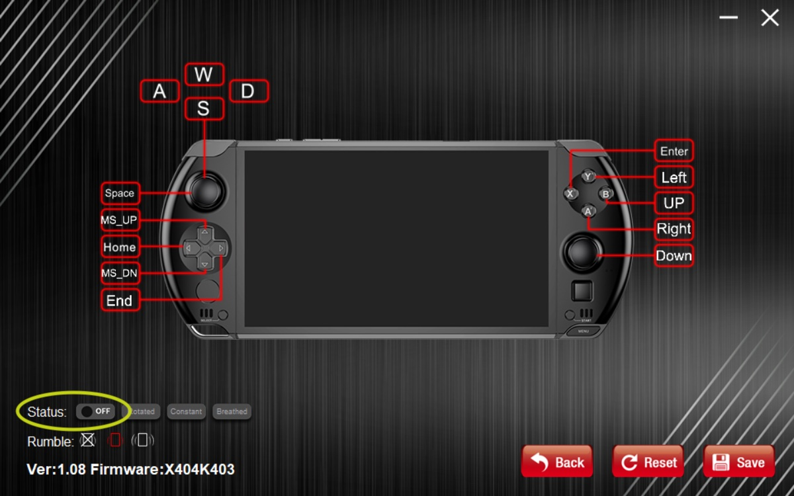
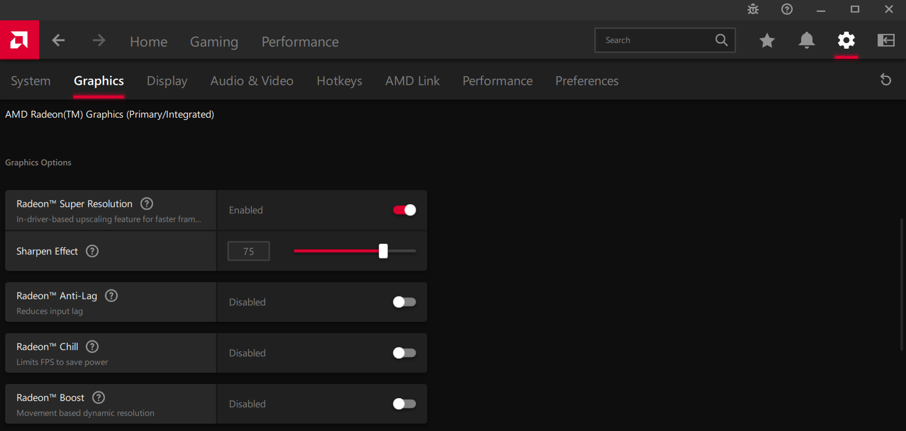
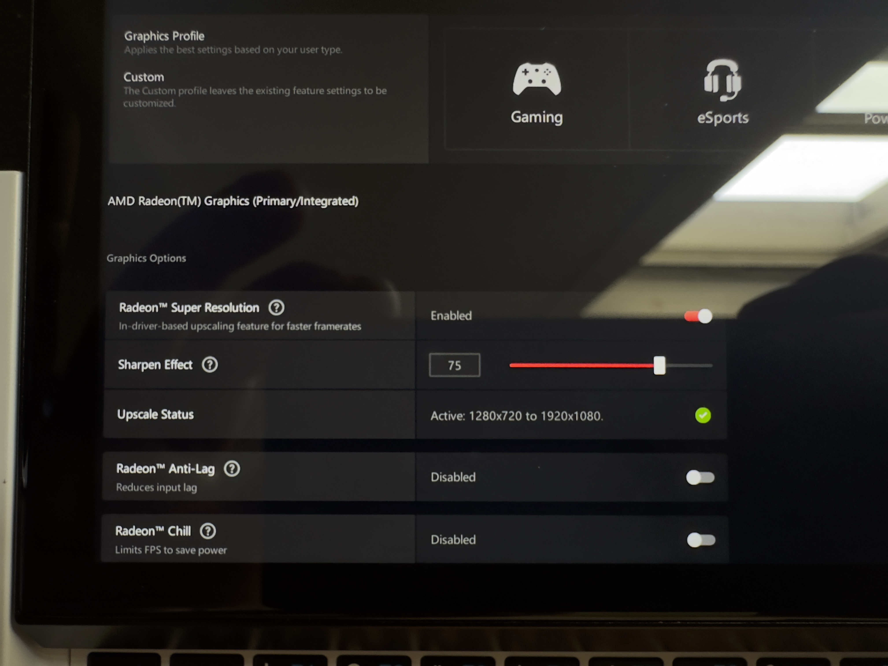
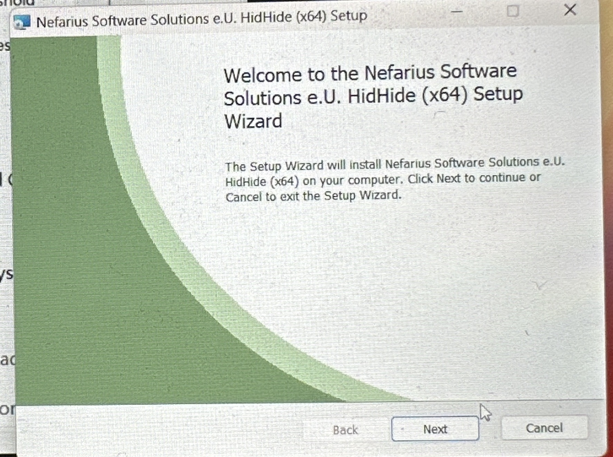
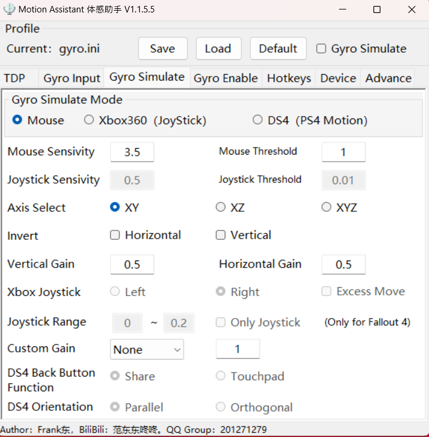
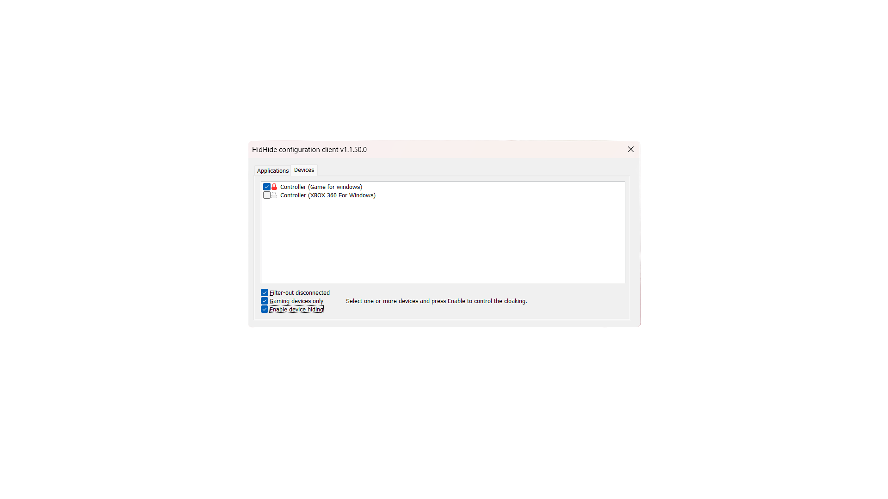

# A guide for GPD WIN4 Owners
<a name="readme-top"></a>
<div align="center">

</div>

<!-- TABLE OF CONTENTS -->
<details>
  <summary>Table of Contents</summary>
  <ol>
    <li>
      <a href="#getting-started">Getting Started</a>
      <ul>
        <li><a href="#known-issues">Known Issues</a></li>
        <li><a href="#installation">Installation</a></li>
        <li><a href="#useful-information">Useful information</a></li>
      </ul>
    </li>
    <li>
      <a href="#drivers--applications">Drivers & Applications</a>
      <ul>
        <li><a href="#6800u-specific">6800u specific BIOS files</a></li>
        <li><a href="#7640u-and-7840u-specific">7640u & 7840u specific BIOS files</a></li>
        <li><a href="#motion-assistant">Motion Assistant</a></li>
        <li><a href="#screen-color-correction">Screen Color Correction</a></li>
        <li><a href="#tdp-tools">TDP Tools</a></li>
        <li><a href="#test-your-device">Test your device</a></li>
      </ul>
    </li>
    <li><a href="#troubleshooting">Troubleshooting</a></li>
    <li><a href="#youtube-videos">Youtube Videos</a></li>
    <li><a href="#accesories--parts">Accesories & Parts</a></li>
    <li><a href="#specs">Specs</a></li>
    <li><a href="#contributing">Contributing</a></li>
    <li><a href="#contact">Contact</a></li>
    <li><a href="#acknowledgments">Acknowledgments</a></li>
  </ol>
</details>

<!-- GETTING STARTED -->
## Getting Started

This is a set of instructions or checklists of sorts for me to follow. This repo is focused mostly on the 6800U variant of the WIN 4 because that is the one I have but most of the information should be relevant for the refresh. For [BIOS files press here](#bios-versions).

How do you know which BIOS your device uses?
|   	| 6800u 	| 7x40u 	|
|---	|-------	|-------	|
|   	| v3.00 	| v0.40 	|
|   	| v3.03 	| v0.42 	|
|   	| v3.04 	| v0.44 	|
|   	| v3.05 	| v0.46 	|
|   	| v3.06 	| v0.47 	|

> for those of us who would love to 3D print some accessories. </br>
***[3D model file](https://github.com/lertsoft/GPD_WIN4/releases/tag/v0.1.1-3DModel)*** </br>
***[Shoulder Buttons - L & R](https://github.com/lertsoft/GPD_WIN4/releases/tag/v0.1.1-3DModel)*** </br>
***[Trigger Buttons](https://github.com/lertsoft/GPD_WIN4/releases/tag/v0.1.1-3DModel)*** </br>
***[Grip Case](https://github.com/lertsoft/GPD_WIN4/releases/tag/0.1.3D-Model)***

**🚨🚨WARNING!🚨🚨 PLEASE IF YOU PLAN ON DOING A FRESH INSTALL I WOULD SUGGEST NOT USING APPS SUCH AS DRIVEREASY, OR CCLEANER AS THOSE APPS WILL FIND THE LATEST DRIVERS BUT THOSE DRIVERS COULD BE FOR A COMPLETELY DIFFERENT DEVICE, SUCH AS AYANEO WHICH HAS A PORTRAIT SCREEN, AND COULD CAUSE SCREEN ISSUES!  [THANKS TO N1CKN4M3 FOR BRINGING THIS POINT](https://discord.com/channels/243411108940087297/950574522011119707/1090989111642423306)🚨🚨**

### Single use websites
   <details>
     <summary>Single use websites</summary>
     
#### Keyboard tests
Test all the keys in your keyboard to make sure they register correctly.</br>
[Keyboard Test Website](https://keyboard-test.space/)

#### VSYNC Tester
See if your monitor / screen is syncing correctly. If it isn't that might cause some screen tearing issues and make your games or apps look not great.
Note: Use chrome for this test as other browsers might have issues. </br>
[VSYNC Tester website](https://www.vsynctester.com/)

#### VRAM Calculator
How much vram would you need to run inference or training of AI models.</br>
[VRAM Calculator](https://vram.asmirnov.xyz/)

#### DRM Free games on Epic store
List of DRM Free games on the epic store, as epic gives out a lot of free games this could be useful to know which one you can just download and store on a drive and forget about without being scared that epic might take it off the store or something.</br>
[DRM Free Games list](https://www.pcgamingwiki.com/wiki/List_of_DRM-free_games_on_Epic_Games_Store)
 </details> 

### Test your Hardware 
1. Test GPU under load, look for black screens. (Use graphically intensive software. ie. AAA games, 3Dmark, photoshop, etc.)
    * [🚨🚨 GPU STRESS TEST SOFTWARE 🚨🚨](https://geeks3d.com/furmark/)
2. Check the bios version (Only update if necessary, see #1 ^^ Above ^^)
3. Test all keyboard keys and buttons.
4. Test all the ports. 
    * USB C 4 - Top. Should charge and transmit up to 40 Gbps.
    * USB A 3.2 - Top. It should transmit up to 10 Gbps. **WIN 4 6800U**
    * OCULINK - Top. It should transmit up to 63Gbps. **Win 4 Refresh 7640U/7840U**
    * USB C 3.2 - Bottom. Should charge and transmit up to 10 Gbps.
    * [Crystal Disk Mark can be used to test storage speeds on all the  ports including MicroSD slot](https://crystalmark.info/en/software/crystaldiskmark/)
5. Test the micro sd card slot. Look for disconnecting and reconnecting issues, and have patience as this might take a day or two of using the slot to notice any unexpected behavior. </br> If testing Micro SD card slot speed, make sure you use UHS-I cards, not UHS-II. The GPD Win4 does not utilize the second-row pins of UHS-II. <details>
                        <summary>UHS-I Pin Layout</summary>
                         </details> 
    
    <details>
    <summary>UHS-II Pin Layout</summary>
      </details>
    
4. Test analog dead-zones and update firmware if needed. [GAMEPAD TESTER](https://gamepad-tester.com).
6. Test the screen
    * [Look for dead pixels](https://www.jscreenfix.com/fix.html)
    * [Test for frame skipping - UFO Test ](https://www.testufo.com/frameskipping)
7. Test the Touch screen for dead-zones. (dragging your finger across the entire screen could help find any)
8. Test the small touchpad ( if it doesn't work or is not working properly update firmware)
9. Look for any gaps in the devices.
    * Check the seams between the top shell and bottom shell.
    * Check for gaps between the screen and the screen holder.
    * Check for more than normal gaps between the sliding screen and keyboard, (According to [GPD](https://www.indiegogo.com/projects/gpd-win-4-smallest-6800u-handheld-console#/updates/22) 0.1~0.3mm variation is acceptable tolerance)
10. [Test your analog stick circularity](https://gamepad-tester.com).
11. Make sure your keycaps, top and bottom shells do not have any cracks.
12. Do a full malware scan or reinstall OS.
13. [STRESS TEST YOUR CPU](https://www.mersenne.org/download/)
</br>

### Baseline Test results
> All these tests were done on a battery, with a stock device. Not a fresh install of windows. </br>
> The USB C test where performed with a TB cable, Crucial P3, and an NVME enclosure. USB A Test was performed with a regular  high-speed USB memory card. </br> This information could be useful when trying out different OS or seeing if an update broke something that should not have been broken.

* Port speeds
    <details>
     <summary>USB 4 type C - Top</summary>
      </details> 

    <details>
     <summary>USB 3.2 type C -  Bottom </summary>
      </details> 
  
    <details>
     <summary>USB 3.2 type A -  Top </summary>
      </details> 
  
    <details>
     <summary>MicroSD Card speed</summary>
      </details> 
     
    <details>
     <summary>Biwin SSD </summary>
      </details> 
     
    <details>
     <summary>Crucial p3 SSD</summary>
      </details> 

* Battery Life
  

### Known Issues

#### Cannot download anything from Google Drive

Solution: Log-In into your google account. This is the best overall solution for GPD and for us too as, I would rather have decently quick access through google drive that having to have to go to a website that most likely than not it will hosted in china thus slower for people not close to china.

#### Screen-related issues 
* **The touch input is not the same as the register input. </br> This issue could have been caused because of the use of the DriverEasy app** </br> After a fresh installation the screen is not inputting the right spot where it was touched. You press in an area but the input is registered in a different area of the screen. [Discord Message](https://discord.com/channels/243411108940087297/950574522011119707/1090985629095034971) </br> [To fix this issue install this driver](https://drive.google.com/file/d/1oTt9tUKAQH48GG91fywMVi0p9U5wdfoY/view?usp=share%5C_link) </br> For More information on this issue [check this Reddit post](https://www.reddit.com/r/gpdwin/comments/124lfe2/trouble_with_touch_calibration_gpd_win_4/) </br> [Discord message confirmation from Fulbringer of this working](https://discord.com/channels/243411108940087297/950574522011119707/1090986774660120706).

* **The touchscreen stops responding after a couple of hours of use.** </br> This issue since to be affecting all units using the bios 3.0.3 which is the one used for almost all of the 16GB RAM models. My unit is affected by it but I am not planning on updating the bios yet.  [](https://gpd.hk/gpdwin4firmwaredriver) [](https://drive.google.com/file/d/1Er7Oo7Rct03LfHotQ3lzOnHNEACnCe7_/view)

* **The screen has sync problems and/or jitters** </br> This issue for what has been talked about on Discord affects everyone unless someone shows proof otherwise because review units from December are affected by this... GPD fixed the issue and published a screen firmware update. **This issue only affects 6800u units as GPD implemented their fixes on any unit release and/or manufacture after may 2023 the month they publicly release the update.
OLD TEXT ~GPD seems to be working on a fix but so far it seems that the problem is being caused by the Chip that turns the screen from portrait to landscape~. If you would like to test your unit to see if it is affected or are just curious to know how to test for this try this [site](https://www.testufo.com/mprt) and focus your eyes on the UFO (subject). Also, this issue is mentioned that it is most noticeable in 2d games. </br> 
  * Work-around for the sync problems using CRU: </br>  </br> Thanks to G-Cat / Bill for finding this work-around. </br> </br>
  *  **GPD official fix** </br> 🚨🚨 NOTE! IT IS HIGHLY UNLIKELY YOU WILL BRICK THE DEVICE WITH THIS METHOD AS DEMONSTRATED BY [N1ckn4m3](https://discord.com/channels/243411108940087297/950574522011119707/1102592791206436945) COUNTLESS QUALITY ASSURANCE TESTS🚨🚨 </br> These are the files and guide needed: [Files](https://github.com/lertsoft/GPD_WIN4/releases/tag/60-hz) </br> [Guide created by e1000 (Community member)](https://docs.google.com/document/d/1KVFI7zn1XTZnpUldCw3RhRy64FLF5FaSaepIormMh0w/mobilebasic) </br> Where the IC connection pins are located: </br>

* **

* **

#### Joystick deadzones
* **Joystick dead zones are huge! I need a fix** </br> To fix this issue update the firmware of your joystick so that you can use the new WinControl dead zone fixed that GPD has provided. This works on every Win device not only Win4 6800u, 7640u, and 7840u. </br> [WinControl 1.14 + Firmware download](https://github.com/lertsoft/GPD_WIN4/releases/tag/v1.14)

   **Steps To Install:**
    1) update the firmware of the controller using the file name **GPD.Gamepad.Win4.X408K407.exe** (Controller has to be in gamepad mode).
    2) once the update is complete, shutdown the device.
    3) power on the device, install the new wincontrol app **GPD.WinControls.V1.14.exe**, and restart the device. 
    4) launch Wincontrol, go to mouse customization, deadzone adjustment sliders at the bottom right of the mouse customization menu. (Current recommended settings by early users suggest putting both sticks to -8 on center; per           > Saracchini’s quick test, -8 gives about 6~8% deadzone and re-centers perfectly; -10 reduces to ~4% deadzone but causes slight jitter during re-centering)

    **Things To Note:**
      1) Version number on ZIP shows 1.14 but Wincontrol UI shows v1.11 - this will be rectified in the next update release; no impact to functionality.
      2) Windows Defender may falsely flag it as malware, but as mod n1ckn4m3  has mentioned, per his checks yesterday, this is a false positive. [](https://discord.com/channels/243411108940087297/950574522011119707/1154484670260592651)</br>

  [GPD Drive link](https://drive.google.com/file/d/1KH_Ag4s-6SWhesRO_hdbgQKzfcVABPBK/view) </br>
  [Discord Instructions to update by Brother Chenwk](https://discord.com/channels/243411108940087297/826965330965430272/1154605827836084344) </br>


</BR>

**To see all the domestic issues [press here](win4domestic.md)**
    
### Installation
> When installing the GPD Provided Windows image do not forget these steps: </br> 1. Format the USB Drive to NTFS. </br> 2. Rename the USB Drive to WINPE </br> 3. Extract the files to USB Drive

 * ***Windows***
    <details>
    <summary>GPD Windows ISO</summary>
     1. <a href="https://gpd.hk/download">Download GPD's windows ISO</a> </br>
     2. Install Windows like you normally would </br>
   
    
   </details>
    
   <details>
     <summary>Clean Windows ISO</summary>
     1. Download Microsoft official ISO: </br>
     <ul>
         <a href="https://www.microsoft.com/en-us/software-download/windows10ISO">Windows 10</a> </br>
         <a href="https://www.microsoft.com/en-us/software-download/windows11">Windows 11</a> </br>
      </ul>
     2. Install Windows like you normally would </br>
    
    </details>
 
  
 * ***SteamOS***
     > Useful repo if venturing into Steam os. [Proton's Direct3D 12 implementation](https://github.com/HansKristian-Work/vkd3d-proton) 
 
 
     <details>
     <summary>SteamDeck OS - Recovery Image</summary>
     1.    <a href="https://help.steampowered.com/en/faqs/view/1B71-EDF2-EB6D-2BB3">Download the Steamdeck OS recovery image from valve</a> </br>
     2.    <a href="https://gist.github.com/drraccoony/8a8d0a9e3dfde9fafd3e374e418d2935#setting-expectations">This gist has all the needed information</a> </br>
     3. Instead of using the Steamdeck image I used another distro Image, and added the Steamdeck UI. Not the same but less painful to install for dual boot.
    
    </details>
    
     <details>
     <summary>Steam OS</summary>
     1.    <a href="https://store.steampowered.com/steamos/buildyourown">Download steamOS official ISO</a> </br>
     2. I tried SteamOS / HoloISO and the experience was lacking for now so I will use other distros. Will give chimeraOS a try and update here.
    
    </details>
    
<p align="right">(<a href="#readme-top">back to top</a>)</p>

### Useful Information

[GPD WIN4 Manual](Manuals/GPD_WIN4_User_Mannual.pdf)

**WIN 4 keeps asking for the BitLocker recovery key**
* Cause: Windows boot menu getting into a fight with the WIN 4's TPM implementation and triggering a false "suspicious activity" that causes Windows to prompt for the key.
* Solution: disable the "new and improved" boot menu on your encrypted volume using `bcdedit /set default bootmenupolicy legacy`

> Once this is done the system can resume after sleep, hibernate, and shut down without prompting for a BitLocker recovery key.
Thanks  to [mouseish](https://discord.com/channels/243411108940087297/950574522011119707/1125430298407088128) for the tidbit!

**Smokeless UMAF does the same as alt+f5 | Reboot**
* The keyboard combo of alt + f5 then reboot does the same that this tool would do [Smokeless UMAF tool](https://github.com/DavidS95/Smokeless_UMAF) </br>
* It is also important to note that the smokeless tool won't show any hidden setting that the Win4 might have. </br>

Thank you Andrebraga for the info!

**Win4 7840u BIOS chip**
> Use case for documenting this are in case anyone needs to reflash with a reprogrammer.
> This could be the same chip use on the 6800u and 7640u devices but I have not checked mine 6800u and nobody has posted about regarding the 7640u.
* it’s on the back of the motherboard. </br>
* BIOS chip: Winbond 25Q256JWEQ </br>

Thank you to [Awkwabear](https://discord.com/channels/243411108940087297/950574522011119707/1162658352933912656)


***Booting from a USB Drive***
* Hold Shift + FN + 7 
</br>

***Turning off the LEDs on the WIN 4**
 * Open the win controls app on the WIM4
 * Go to "Mouse mode customization"
 * look for "status"
 * Next to status there will be an "on" button press that to turn it off
 
 
 </br>

**Reducing the CPU Temps**
> Charral Message: Gelid GP-Ultimate thermal pads size 1.5mm & 1mm work perfectly on the VRMs with NT-H2 significantly reducing the CPU temps due to the original paste not being so fantastic.
* Using this thermals pads, and repasting the WIN4 could reduce the temps from 79c to 67c, [see this message](https://discord.com/channels/243411108940087297/950574522011119707/1099991883847049246)
* [Pads](https://www.amazon.com/dp/B0922H1V6V?th=1)
* [Paste](https://www.amazon.com/Noctua-NT-H2-Thermal-Cleaning-Performance/dp/B07MZ45X9G/)
* [PTM7950](https://www.moddiy.com/products/Honeywell-PTM7950-SP-Super-Highly-Thermally-Conductive-PCM-Pad.html)

***Use Custom Resolution Utility (CRU) to create different screen refresh rates ie. 40hz***
> GPD took away the option of 40hz on the WIN4 panel because of frame skipping, and stability. CRU allows you to create that refresh rate and use it.

[Download Link](https://www.monitortests.com/forum/Thread-Custom-Resolution-Utility-CRU)
</br>

***Setting Up RSR***
> RSR is AMD's solution to AI upscaling, similar to FSR but instead of it being game dependent it is game independent as it upscales at a driver level and not an application/game level.

1. Install AMD Adrenalin
2. Go to Settings > Graphics
3. Enable Radeon Super Resolution (RSR)
4. Choose your sharpen effect - 50 to 75 is best. </br> </br>
     </br>
5. Now navigate to hotkeys - Settings > Hotkeys
6. Enable the use of Hotkeys
  a. This is so that you can see an overlay of AMD Adrenalin in the game to make sure that it is working.
7. Now you are all set. RSR is enabled for all games.
8. Test that it works by lowering your game resolution to for example; 1280 by 720
9. Open the overlay using the hotkeys - The default is ALT+R and you will see something like this. </br> </br>
 </br>

***Changing the iGPU vRAM allocation***
> Note: The ram on the GPD Win 4 is shared meaning that the 16GB or 32GB of RAM of the device will go to both the CPU and GPU which could hamper the performance of the devices depending on the configuration. The recommended amount of VRAM is 4GB for the 16GB RAM model, and 8GB for the 32GB RAM model.

1. Enter BIOS by holding the DEL key during boot
2. Go to the "Advanced" tab
3. Go to the "CBS" tab
4. Go to the "NBIO" tab
5. Go to "GFX Configuration"
6. Change "UMA Frame buffer Size" to the desired value, the recommended value is 4GB for the 16GB RAM model, and 8GB for the 32GB RAM model.
7. Press ESC and go to the "Save & Exit" tab
8. Select "Save Changes and Exit" and select "Yes"

> ***btprice2001*** shared these images on the discord to show the difference between different vRAM allocations at different TDPs.


***Setting up Gyro on Motion Assistant***

1. Open MotionAssistant.
2. Click the checkbox for Gyro Simulate. </br>
    a. It will ask you to install a driver from Nefarius Software Solutions. Don't worry Nefarius is a Open-Source Dev [Check his/her work here](https://github.com/ViGEm/ViGEmBus) </br></br>
    </br>
3. Install the program (HIDHide) like you normally would.
4. Now, Go to c: > Program Files > Motion Assistant > Drivers
5. Install all the drivers in this folder. </br>
  a. Do not go online and install newer versions of them as that could mean that Gyro will not work. Motion Assistant needs the versions it is providing.
6. Go to the gyro Simulate tab. </br>
    a. pick Xbox360 for now. </br> </br>
   </br>
8. Search for hidhide on Windows search.
9. Check these checkboxes: </br>
    a. Controller (Game for Windows). </br>
    b. Enable device hiding. </br> </br>
     </br>
10. Search for Joy.cpl to make sure that the non-gyro controller is hiding.
11. Use joy.cpl to Test that it is working.
12. Check on the device manager to see if there is more than one controller.
14. We are done!

> PS; I am not able to use the gyro controller on Steam games because for some reason I have two controllers recognized and the one that Steam is using had to be the non-gyro one. :/ </br> I will continue this guide on the [troubleshooting area](#troubleshooting)


<p align="right">(<a href="#readme-top">back to top</a>)</p>

<!-- DRIVERS & APPLICATIONS -->
## Drivers & Applications
> GPD Official release drivers are out! This is the link to get them. [GPD Download page](https://gpd.hk/gpdwin4firmwaredriver)

1. [AMD Adrenalin software](https://www.amd.com/en/support/apu/amd-ryzen-processors/amd-ryzen-7-mobile-processors-radeon-graphics/amd-ryzen-7-6800u)
2. [GPD Driver pack](https://github.com/lertsoft/GPD_WIN4/releases/tag/v5)
3. [GPD Windows 11 22H2](https://gpd.hk/gpdwin4firmwaredriver)
4. Motion Assistant <br>
    a. [Original Source](https://gpd.hk/gpdwin4firmwaredriver) </br>
    b. [download link](https://github.com/lertsoft/GPD_WIN4/releases/tag/v1.1.62) </br>
    c. [Motion Assistant Manual](Manuals/Motion_Assitant_manual.pdf) </br>
    d. [Motion Assistant setup and benefits](https://www.youtube.com/watch?v=M3NNxC-BYQs) </br>
    e..[Motion Assistant doesn't start after clean Windows 11 install fix - just install Microsoft Visual C++ 2015 - 2022 Redistributable](https://aka.ms/vs/17/release/vc_redist.x64.exe) </br>
5. WIN Control <br>
    a. [Original Source](https://gpd.hk/gpdwin4firmwaredriver) </br>
    b. [download link](https://github.com/lertsoft/GPD_WIN4/releases/tag/v1.10) </br>
    c. [WIN Controls Manual](Manuals/GPD_Win_Controls_Manual.pdf) </br>
6. [Windows Debloating tool](https://christitus.com/windows-tool/) </br>

### BIOS Files
> 🚨🚨Be careful using these files as they could cause issues if you do not know what you are doing!🚨🚨

**Make sure that during the upgrading or downgrading your device is charging or at least at 100% battery**

 * To downgrade the Bios follow these steps: </br> 
   > 1. Format a USB Drive to FAT32. </br> 2. Copy the files to the ROOT of the USB drive. <br> 3. Use FN + F7 to boot using the USB. </br> 4. Wait </br>     5. When all the lights are off, turn the device back on. </br> 6. Wait. If it doesn't boot after 10 minutes, reset the BIOS using the PIN hole </br> 7. Wait. </br> 8. After 10 to 20 minutes, it should be downgraded.

  * Upgrading the bios is pretty similar to the downgrade process. Also, GPD provided a little guide, here are the steps: </br>
    > 1. Format a USB drive to FAT32. </br> 2. Copy the files to the ROOT of the USB drive. </br> 3. Press FN + F7 to boot using the USB. </br> 4.         Select the USB drive. </br> 5. Wait. </br> 6. Wait. If it doesn't boot after 10 minutes, reset the BIOS using the PIN hole. </br> 7. Now it should be      upgraded.

#### BIOS Versions

🚨🚨BEFORE PROCEEDING WITH A BIOS UPGRADE OR DOWNGRADE PLEASE BOTHER TO READ WHAT THE REPO SAYS ABOUT EACH VERSION AND DEVICE MODEL AS FLASHING A 6800U BIOS ON THE 7X40U DEVICE WOULD BRICK IT.🚨🚨 </BR>
🚨🚨IF YOU DO NOT HAVE ANY ISSUES ON YOUR  DEVICE DO NOT START FLASHING BIOS FILES AS THAT COULD CAUSE ISSUES.🚨🚨 </BR>
THE TABLE IS TO HELP YOU IDENTIFY FOR WHICH DEVICE EACH BIOS VERSION IS SUPPOSE TO GO BUT YOU HAVE TO VERIFY.

|   	| 6800u 	                                                            | 7x40u                                                             	|
|---	|------------------------------------------------	                    |-------------------------------------------------------------------	|
|   	| [v3.00](https://github.com/lertsoft/GPD_WIN4/releases/tag/v3.00)  	| [v0.40]((https://github.com/lertsoft/GPD_WIN4/releases/tag/v0.40)) 	|
|   	| [v3.03](https://github.com/lertsoft/GPD_WIN4/releases/tag/v3.03)   	| [v0.42](https://github.com/lertsoft/GPD_WIN4/releases/tag/v0.42)    |
|   	| [v3.04](https://github.com/lertsoft/GPD_WIN4/releases/tag/v3.04) 	  | [v0.44]((https://github.com/lertsoft/GPD_WIN4/releases/tag/v0.44)) 	|
|   	| [v3.05]((https://github.com/lertsoft/GPD_WIN4/releases/tag/v3.05)) 	| [v0.46](https://github.com/lertsoft/GPD_WIN4/releases/tag/v0.46)   	|
|   	| [v3.06]((https://github.com/lertsoft/GPD_WIN4/releases/tag/v3.06)) 	| [v0.47](https://github.com/lertsoft/GPD_WIN4/releases/tag/v0.47) 	  |

#### 6800u specific 

**[BIOS v3.00 6800u](https://github.com/lertsoft/GPD_WIN4/releases/tag/v3.00)** </br> This Version has unlocked TDP, and Fan controls.

**[BIOS v3.03 6800u](https://github.com/lertsoft/GPD_WIN4/releases/tag/v3.03)** </br> This version fixes some issues? I do not have a changelog for it but is the one my device was shipped with. It has an unresponsive touchscreen, The volume buttons should work on Linux, and has a USB C port issue.

**[BIOS v3.04 6800u](https://github.com/lertsoft/GPD_WIN4/releases/tag/v3.04)** </br> This version fixes the unresponsive touchscreen, and USB C ports Issue. It is not fixed for the hz and panel skipped frames.

**[BIOS v3.05 6800u](https://github.com/lertsoft/GPD_WIN4/releases/tag/v3.05)** </br> This version fixes the unresponsive touchscreen, and USB C ports Issue just as 3.04. It also fixes the issue that 3.04 introduced of not outputting video from the USB-C ports. It is not fixed for the hz and panel skipped frames.

**[BIOS v3.06 6800u](https://github.com/lertsoft/GPD_WIN4/releases/tag/v3.06)** </br> This version should fix the WIN4 volume buttons not working when waking up from sleep in Linux, Fixes the problem where the USB-C port at the bottom does not display in v3.04, It resolves some issues where the device may crash under abnormal conditions, Additionally, it adds support for screen firmware updates by providing a screen firmware upgrade interface by updating the EC to version 8.0 from version 7.8.

#### 7640u and 7840u specific

**[BIOS v0.40 7640u & 7840u](https://github.com/lertsoft/GPD_WIN4/releases/tag/v0.40)** </br> 

**[BIOS v0.42 7640u & 7840u](https://github.com/lertsoft/GPD_WIN4/releases/tag/v0.42)** </br> 

**[BIOS v0.44 7640u & 7840u](https://github.com/lertsoft/GPD_WIN4/releases/tag/v0.44)** </br> 

**[BIOS v0.46 7640u & 7840u](https://github.com/lertsoft/GPD_WIN4/releases/tag/v0.46)** </br> 

**[BIOS v0.47 7640u & 7840u](https://github.com/lertsoft/GPD_WIN4/releases/tag/v0.47)** </br> 


### Screen Color Correction
> These files were provided by GPD. See the video description. </br>

* [Files](Color_Correction)

* [GPD Color correction Video](https://www.youtube.com/watch?v=-QiW4Zqy-6E)

### Adding more Screen refresh rates (40hz, 30hz, etc.)
> Use this third-party application
[CRU](https://www.monitortests.com/forum/Thread-Custom-Resolution-Utility-CRU)

### TDP Tools
> Gifs are from Sabrina's GitHub.

Out of all the TDP Tools, I would ask myself any of these questions before deciding: </br>
* Do I want to Tinker and be in charge of every detail? Choose [Ciphray.bat](https://discord.com/channels/243411108940087297/1065818597844340777/1076236291705946182)
* Do I want some control but not so much granularity? Choose [Motion Assistant](https://github.com/lertsoft/GPD_WIN4/releases/tag/v1.1.73) </br>
  * Could also choose Handheld Control Panel [HCP](https://github.com/project-sbc/Handheld-Control-Panel) </br>
  * Another option is Universal x86 Tuning Utility Handheld [UXTU Handheld](https://github.com/JamesCJ60/Universal-x86-Tuning-Utility-Handheld/releases)
* Do I want the program to just do everything for me and I just choose the max TDP? Choose [SmarterTDP](https://github.com/BillPlus/SmarterTDP)

Hopefully, this helps you decide too. </br>
Also, give them all a try as you might find some more intuitive than others or you might find some exoteric function that you didn't know was possible.

#### Motion Assistant
Motion Assistant is so much more than just a TDP Tool. It has fan controls, Gyro settings, Hotkeys, and a framerate limit. </br> 
Best for people who want an all-in-one solution.

a. [Original Source](https://gpd.hk/gpdwin4firmwaredriver) </br>
b. [download link for MA 1.1.73](https://github.com/lertsoft/GPD_WIN4/releases/tag/v1.1.73) </br>
c. [Motion Assistant Manual](Manuals/Motion_Assitant_manual.pdf) </br>
d. [Motion Assistant setup and benefits](https://www.youtube.com/watch?v=M3NNxC-BYQs) </br>


#### [SmarterTDP](https://github.com/BillPlus/SmarterTDP)
SmarterTDP is an awesome solution that manages only TDP but it does a great job at that! Perfect if you want a simple, one-click TDP solution to set it and forget it but that will adapt to your device needs.

#### [Ciphray.bat](https://discord.com/channels/243411108940087297/1065818597844340777/1076236291705946182)
Ciphray.bat has a high learning curve but the amount of controls and granularity that you get from it is amazing. If you love to tinker or maybe learn more about all the different settings, nuts and bolts to put something unique to your needs this will be it.
a. The Phawk made a video explaining how to set this bat boy up in 6800U devices. [LINK](https://www.youtube.com/watch?v=ZnEQ068poY0)


#### Universal x86 Tuning Utility Handheld
> Project SBC contributed to this project upstream project called [Universal x86 Tuning Utility](https://github.com/JamesCJ60/Universal-x86-Tuning-Utility) which is cool to see someone that has provided us with so many great tools contribute to others so that we get more and more options!

Manage, Control, and change the TDP and other settings of any x86 device Intel or AMD.</br>
https://github.com/JamesCJ60/Universal-x86-Tuning-Utility-Handheld/releases </br>

#### Handheld Control Panel
> Project SBC is working on adding and solving as many of the pain points that handheld users have with this software!

Manage, Control, and change the TDP and other settings of the compatible devices.</br>
https://github.com/project-sbc/Handheld-Control-Panel </br>

#### ~Power Control Panel v2~ DISCONTINUED
> Project SBC The Devs of Power Control Panel V2 (PCP V2) have moved all the new features and development to a new project called Handheld Control Panel (HCP) and are working on a new version that will add more TDP features. If interested Please see above  ⬆️⬆️⬆️ </br> </br> I will keep this info here so that people looking for PCPV2 know of the new software.

Control and change the TDP of the compatible devices.</br>
https://github.com/project-sbc/Power-Control-Panel-v2 </br>

[](https://user-images.githubusercontent.com/74781086/206900406-57df3589-3ee1-47e6-a303-9cdc6c9552c1.png)

#### Handheld Companion
Use cases taken from the Handheld companion repo:
```
" You want to add universal motion controls (UMC) to any game.
You want to add high-precision motion controls to your Windows game library through Steam.
You want to play your Sony Playstation 4 library through PlayStation Now or PS4 Remote Play.
You want to enjoy all your Wii, WiiU, and Switch games with full motion controls through UDP motion control protocol. "
```
https://github.com/Valkirie/HandheldCompanion/tree/0.14.0.9

#### Universal x86 Tuning Utility
> Upstream project for the handheld version of this same tool.

Manage, Control, and change the TDP and other settings of any x86 device Intel or AMD.</br>
https://github.com/JamesCJ60/Universal-x86-Tuning-Utility


### Test your device
***GPU***</br>
https://github.com/kruzer/poclmembench/tree/0.91

***CPU, GPU, RAM, & Others***</br>
https://www.passmark.com/products/performancetest/index.php

<p align="right">(<a href="#readme-top">back to top</a>)</p>

<!-- TROUBLESHOOTING -->
## Troubleshooting

- **Gyro is not working :(** </br>
  > For some reason HIDHIDE is not hiding one of the controllers to steam, and to the OS. So I still get two different controllers running on my Device Manager.

- **USB A speeds are not as advertised** </br>
   > If after testing your USB A port your speeds are not up to the standard of USB 3.2 and your device has speeds closer to USB 2 than USB 3 then this could be a temporary solution/workaround. Thanks to **DesignGears** on Discord [Message Link](https://discord.com/channels/243411108940087297/950574522011119707/1086042020528787566) :) 
  
  1. Connect a USB A to USB Hub. Test.
  2. If it didn't work check the Windows device manager, and USBDeview and see if the devices are there with the specified spec ie. USB 3.2
  3. If it didn't work check for the latest drivers ie. GPD, AMD Adrenalin, Windows, ETC. 
  4. If it didn't work test it on Linux.
  5. if it didn't work reset BIOS, using the little pinhole on the side.
  6. If it didn't work check that your device internals is correctly connected.
  7. If none of these steps worked check in with GPD support because that might be faulty parts.
  
  **DesignGears** tests screenshots before and after the fix/workaround.
  <details>
  <summary>Before Inserting the USB Hub speeds</summary>
   </details> 
    
   <details>
   <summary>After inserting the USB Hub speeds</summary>
     </details>
    
  
- **TouchScreen is not working** </br>
   > If you used an SSD or SD Card from another device and that storage device had the screen drivers from a different device ie. Ayaneo, Steamdeck, etc. </br> It could turn the screen in a portrait orientation, and cause touchscreen, and/or panel issues on the GPD Win4. If you run into these issues follow these steps. Thanks to **DesignGears** on Discord [Message Link](https://discord.com/channels/243411108940087297/950574522011119707/1090683247329030247) :) 
  
  1. [Download the new driver for the screen.](https://github.com/lertsoft/GPD_WIN4/releases/tag/v5.1)
  2. Install the drivers
  3. Restart the device
  4. The issue should be fixed.
  5. If not. Send a message to Kendyz or ask a question on Discord or here.
  
- **The touch input is not the same as the register input** </br>
   > This issue could have been caused because of the use of the DriverEasy, or CCleaner apps to update drivers. </br> After a fresh installation the screen is not inputting the right spot where it was touched. You press in an area but the input is registered in a different area of the screen. [Discord Message](https://discord.com/channels/243411108940087297/950574522011119707/1090985629095034971) </br>
   > [Discord message confirmation from Fulbringer of this working](https://discord.com/channels/243411108940087297/950574522011119707/1090986774660120706).
    
  1. [Download these drivers](https://drive.google.com/file/d/1oTt9tUKAQH48GG91fywMVi0p9U5wdfoY/view?usp=share%5C_link)
  2. Install the drivers
  3. Restart the device
  4. The issue should be fixed.
  5. If not. [check this Reddit post](https://www.reddit.com/r/gpdwin/comments/124lfe2/trouble_with_touch_calibration_gpd_win_4/)
  6. If not. Send a message to Kendyz or ask a question on Discord or here.</br>
 
  
  

<p align="right">(<a href="#readme-top">back to top</a>)</p>

<!-- TUTORIALS, REVIEWS AND VIDEOS -->

## Tutorials
- How to use Crystal Disk Mark to test storage and port speeds. [LINK](https://www.grdian.com/resources/how-to-use-crystaldiskmark-to-test-your-storage-device)

- In-Depth Review from Notebookcheck. [LINK](https://www.notebookcheck.net/GPD-Win-4-handheld-PC-review-1080p-Ryzen-7-gaming-in-the-palm-of-your-hand.700543.0.html). </br> Please note; The microSD card that they used for their test is UHS-II which **DesignGears** on discord tested and found out they will never reach the UHS-II speed because the slot is designed for UHS-I cards, see difference in the pin layouts <a href="#getting-started">HERE</a>.

<p align="right">(<a href="#readme-top">back to top</a>)</p>

## Youtube Videos

The Phawx </br>
- Setting up Motion Assistant on the WIN4. [LINK](https://www.youtube.com/watch?v=WWkmyAxn6-E) </br>
- Setting up Auto TDP tool on 6800U devices. [LINK](https://www.youtube.com/watch?v=ZnEQ068poY0)
- Comparison between Z1, 6800u, 7840u, and steam deck APU. [LINK](https://www.youtube.com/watch?v=BOMiEI7ojd8&t=881s)

TheRelaxingEnd </br>
- ASMR Video of the GPD Win 4. [LINK](https://www.youtube.com/watch?v=livIIS8MYe0)

NITTRX </br>
- Disassembly of the GPD Win 4. [LINK](https://www.youtube.com/watch?v=dhbx1abJWTc)

AquaKlef </br>
- Motion Assistant setup and Gyroscope benefits. [LINK](https://www.youtube.com/watch?v=M3NNxC-BYQs)


<p align="right">(<a href="#readme-top">back to top</a>)</p>

<!-- ACCESSORIES AND REPAIR PARTS -->
## Accessories & Parts

GPD Win 4 Thumbstick Protector </br> 
I love this protector. They actually do what I wanted them to do which is prevent the click of the sticks when on my backpack. They are better and easier to use than the Linus Tech Tips silicone covers, and you get the option of also being able to get one that allows for protection when using a Skull & Co Thumb grip.</br>
https://www.etsy.com/listing/1468795898/gpd-win-4-thumbstick-protectorcover?ref=yr_purchases

Batteries from GPD AliExpress store.</br>
https://www.aliexpress.us/item/3256802595312541.html?gatewayAdapt=Pc2Msite </br>
https://www.aliexpress.us/item/3256803076020665.html?gatewayAdapt=Pc2Msite </br>

GPD WIN4 Skins. </br> 
https://sopiguard.com/collections/gaming-1/products/for-gpd-win-4?variant=45034656334125 
</br>

GPD WIN4 Deckmate compatible clip-on back. </br> 
https://www.thingiverse.com/thing:6100878
</br>

GPD Win 3 replacement Joystick by [Dovah](https://www.thingiverse.com/dovahkiiiin/designs)</br>
Someone said on Discord that the Joystick for Win 3 and Win 4 are the same but I will update once the retail unit starts arriving in people's hands. </br>
https://www.thingiverse.com/thing:5100417

<p align="right">(<a href="#readme-top">back to top</a>)</p>


<!-- SPECS AND HARDWARE DETAILS -->
## Specs
```
Any SSD that is single-sided should work on the GPD Win 4.
These are some of them.
```
* WD Black SN770
* Crucial P3

> Really good video by The Phawk packed with info, benches, and comparison between Z1, 6800u, 7840um, and steam deck APU. [LINK](https://www.youtube.com/watch?v=BOMiEI7ojd8&t=881s)

#### GPD WIN 4 Specs
> Specs for the Orginal WIN 4 with 6800u


> Specs for WIN 4 Refresh with 7840u, and 7640U


<p align="right">(<a href="#readme-top">back to top</a>)</p>

<!-- CONTRIBUTING -->
## Contributing

Contributions are what make the open-source community such an amazing place to learn, inspire, and create. Any contributions you make are **greatly appreciated**.

If you have a suggestion that would make this better, please open an issue with the tag "enhancement".
Don't forget to give the project a star! Thanks again!

* [Open a new issue](https://github.com/lertsoft/GPD_WIN4/issues)

<p align="right">(<a href="#readme-top">back to top</a>)</p>

<!-- CONTACT -->
## Contact

Project Link: [https://github.com/lertsoft/GPD_WIN4](https://github.com/lertsoft/GPD_WIN4)

<p align="right">(<a href="#readme-top">back to top</a>)</p>

<!-- ACKNOWLEDGMENTS -->
## Acknowledgments
* [DesignGears]()
* [btprice2001]()
* [Sabrina](https://github.com/SabrinaRDC/WM2-Help)
* [The Phawx](https://www.youtube.com/@ThePhawx)

<p align="right">(<a href="#readme-top">back to top</a>)</p>
