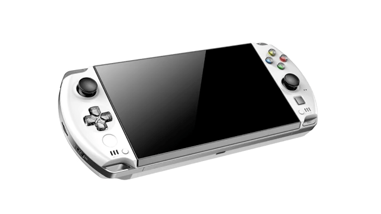
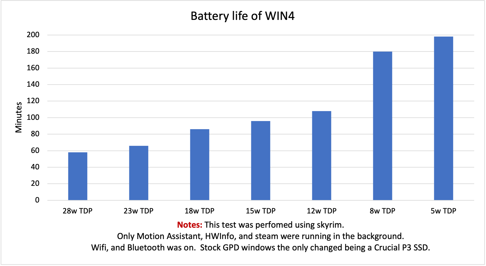
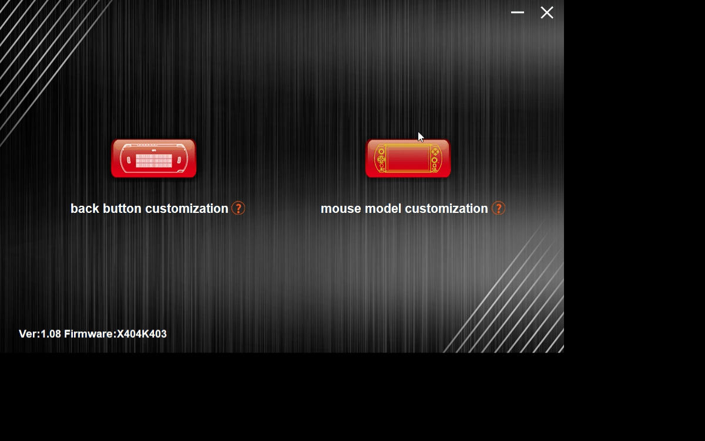
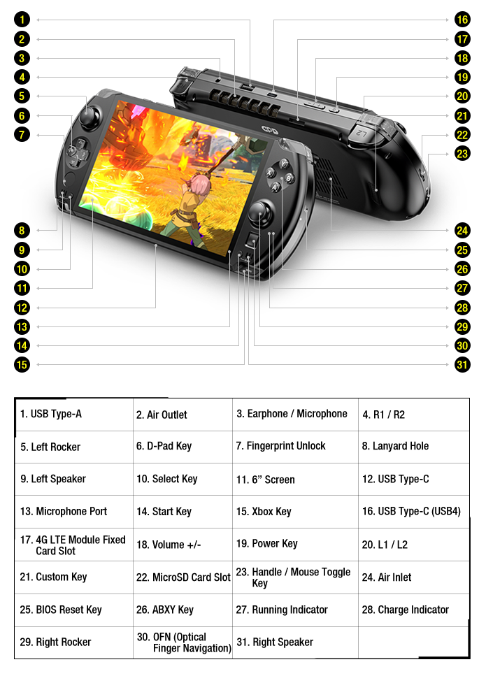
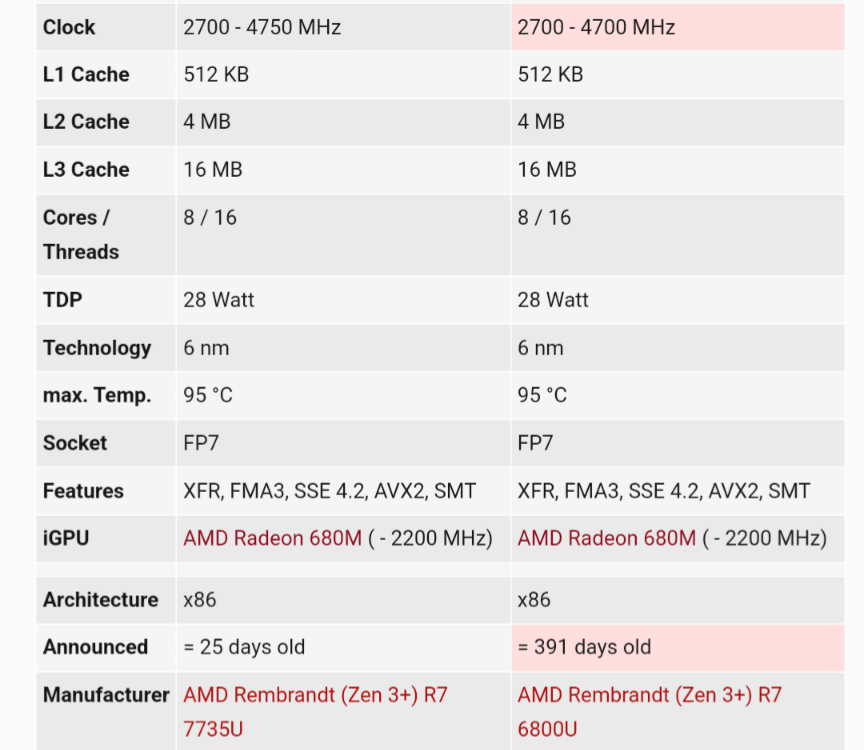

# A guide for GPD WIN4 Owners
<a name="readme-top"></a>
<div align="center">

</div>

<!-- TABLE OF CONTENTS -->
<details>
  <summary>Table of Contents</summary>
  <ol>
    <li>
      <a href="#getting-started">Getting Started</a>
      <ul>
        <li><a href="#known-issues">Known Issues</a></li>
        <li><a href="#installation">Installation</a></li>
        <li><a href="#useful-information">Useful information</a></li>
      </ul>
    </li>
    <li>
      <a href="#drivers--applications">Drivers & Applications</a>
      <ul>
        <li><a href="#motion-assistant">Motion Assistant</a></li>
        <li><a href="#screen-color-correction">Screen Color Correction</a></li>
        <li><a href="#tdp-tools">TDP Tools</a></li>
        <li><a href="#test-your-device">Test your device</a></li>
      </ul>
    </li>
    <li><a href="#troubleshooting">Troubleshooting</a></li>
    <li><a href="#youtube-videos">Youtube Videos</a></li>
    <li><a href="#accesories--parts">Accesories & Parts</a></li>
    <li><a href="#specs">Specs</a></li>
    <li><a href="#contributing">Contributing</a></li>
    <li><a href="#contact">Contact</a></li>
    <li><a href="#acknowledgments">Acknowledgments</a></li>
  </ol>
</details>

<!-- GETTING STARTED -->
## Getting Started

This is an set of instruction or checklist of sorts for me to follow once I get my device. I will do two different ones because I will be doing a fresh install of windows on a new SSD, and the included SSD will be left for trouble-shooting.

> for those of us that would love to 3D print some accesories. </br>
***[3D model file](https://github.com/lertsoft/GPD_WIN4/releases/tag/v0.1.1-3DModel)*** </br>
***[Shoulder Buttons - L & R](https://github.com/lertsoft/GPD_WIN4/releases/tag/v0.1.1-3DModel)*** </br>
***[Trigger Buttons](https://github.com/lertsoft/GPD_WIN4/releases/tag/v0.1.1-3DModel)*** </br>
***[Grip Case](https://github.com/lertsoft/GPD_WIN4/releases/tag/0.1.3D-Model)***

**🚨🚨WARNING!🚨🚨 PLEASE IF YOU PLAN ON DOING A FRESH INSTALL I WOULD SUGGEST NOT USING APPS SUCHS AS DRIVEREASY, OR CCLEANER AS THOSE APPS WILL FIND THE LATEST DRIVERS BUT THOSE DRIVERS COULD BE FOR A COMPLETELY DIFFERENT DEVICE, SUCH AS AYANEO WHICH HAS A PORTRAIT SCREEN, AND COULD CAUSE SCREEN ISSUES!  [THANKS TO N1CKN4M3 FOR BRINGING THIS POINT](https://discord.com/channels/243411108940087297/950574522011119707/1090989111642423306)🚨🚨**

### Test your Hardware 
1. Test gpu under load, look for black screens. (Use graphically instensive software. ie. AAA games, 3dmark, photoshop, etc.)
    * [🚨🚨 GPU STRESS TEST SOFTWARE 🚨🚨](https://geeks3d.com/furmark/)
2. Check bios version (Only update if necessary, see #1 ^^ Above ^^)
3. Test all keyboard keys and buttons.
4. Test all the ports. 
    * USB C 4 - Top. Should charge and transmit up to 40 Gbps.
    * USB A 3.2 - Top. Should transmit up to 10 Gbps.
    * USB C 3.2 - Bottom. Should charge and transmit up to 10 Gbps.
    * [Crystal Disk Mark can be used to test storage speeds on all the  ports including MicroSD slot](https://crystalmark.info/en/software/crystaldiskmark/)
5. Test the micro sd card slot. Look for disconnecting and reconnecting issues, have patience as this might take a day or two of using the slot to notice any unexpected behavior. </br> If testing Micro SD card slot speed make sure you use UHS-I cards and not UHS-II. The GPD Win4 does not utilize the second row pins of UHS-II. <details>
                        <summary>UHS-I Pin Layout</summary>
                         </details> 
    
    <details>
    <summary>UHS-II Pin Layout</summary>
      </details>
    
4. Test analog deadzones and update firmware if needed. [GAMEPAD TESTER](https://gamepad-tester.com).
6. Test the screen
    * [Look for dead pixels](https://www.jscreenfix.com/fix.html)
    * [Test for frame skipping - UFO Test ](https://www.testufo.com/frameskipping)
7. Test the Touch screen for deadzones. (dragging your finger across the entire screen could help finding any)
8. Test the small touchpad ( if it doesn't work or is not working properly update firmware)
9. Look for any gaps on the devices.
    * Check the seams between the top shell and bottom shell.
    * Check for gaps between the screen and the screen holder.
    * Check for more than normal gaps between the sliding screen and keyboard, (According to [GPD](https://www.indiegogo.com/projects/gpd-win-4-smallest-6800u-handheld-console#/updates/22) 0.1~0.3mm variation is acceptable tolerance)
10. [Test your analog stick circularity](https://gamepad-tester.com).
11. Make sure your keycaps, top and bottom shell does not have any cracks.
12. Do a full malware scan, or reinstall OS.
13. [STRESS TEST YOUR CPU](https://www.mersenne.org/download/)
</br>

### Baseline Test results
> All this test were done on battery, with a stock device. Not a fresh install of windows. </br>
> The USB C test where perfomed with a TB cable, Crucial P3, and a NVME enclousure. USB A Test was perfomed with a regular  high-speed USB memory card. </br> This information could be useful when trying out different OS or seeing if an update broke something that should not have been broken.

* Port speed's
    <details>
     <summary>USB 4 type C - Top</summary>
      </details> 

    <details>
     <summary>USB 3.2 type C -  Bottom </summary>
      </details> 
  
    <details>
     <summary>USB 3.2 type A -  Top </summary>
      </details> 
  
    <details>
     <summary>MicroSD Card speed</summary>
      </details> 
     
    <details>
     <summary>Biwin SSD </summary>
      </details> 
     
    <details>
     <summary>Crucial p3 SSD</summary>
      </details> 

* Battery Life
  


**🚨🚨🚨🚨INTERNATIONAL SHIPMENT STARTED ON MONDAY 20/03/2023🚨🚨🚨🚨**

### Known Issues

**🚨🚨🚨🚨ALL THIS ISSUES REPORTS ARE FROM IGG CUSTOMERS IE, INTERNATIONAL🚨🚨🚨🚨** </BR>
#### Screen related issues 
* **The touch input is not the same as the register input. </br> This issue could have been cause because of the use of the DriverEasy app** </br> After a fresh installation the screen is not inputting the right spot of where it was touch. You press in a area the but the input is register in a different area of the screen. [Discord Message](https://discord.com/channels/243411108940087297/950574522011119707/1090985629095034971) </br> [To fix this issue install this driver](https://drive.google.com/file/d/1oTt9tUKAQH48GG91fywMVi0p9U5wdfoY/view?usp=share%5C_link) </br> For More information on this issue [check this reddit post](https://www.reddit.com/r/gpdwin/comments/124lfe2/trouble_with_touch_calibration_gpd_win_4/) </br> [Discord message confirmation from Fulbringer of this working](https://discord.com/channels/243411108940087297/950574522011119707/1090986774660120706).

* **The touchscreen stops responding after a couple of hours of use.** </br> This issue since to be affecting all units using the bios 3.0.3 which is the one used for almost all of the 16gb ram models. My unit is affected by it but I am not planning on updating the bios yet.  [](https://gpd.hk/gpdwin4firmwaredriver) [](https://drive.google.com/file/d/1Er7Oo7Rct03LfHotQ3lzOnHNEACnCe7_/view)

* **The screen have sync problems and/or jitters** </br> This issue for what have been talked about on discord affect everyone unless someone show prove otherwise because review units from december are affected by this... GPD seems to be working on a fix but so far it seems that the problem is being caused by the Chip that turns the screen from portrait to landscape. If you would like to test your unit to see if it is affected or just curious to know how to test for this try this [site](https://www.testufo.com/mprt) and focus your eyes on the on the UFO (subject). Also this issue is mentioned that it is most noticeble on 2d games.

* **

* **

</BR>

**To see all the domistic issues [press here](win4domestic.md)**
    
### Installation
> When installing the GPD Provided Windows image do not forget these steps: </br> 1. Format the USB Drive to NTFS. </br> 2. Rename the USB Drive to WINPE </br> 3. Extract the files to USB Drive

 * ***Windows***
    <details>
    <summary>GPD Windows ISO</summary>
     1. <a href="https://gpd.hk/download">Download GPD's windows ISO</a> </br>
     2. Install Windows like you normally would </br>
   
    
   </details>
    
   <details>
     <summary>Clean Windows ISO</summary>
     1. Download microsoft official ISO: </br>
     <ul>
         <a href="https://www.microsoft.com/en-us/software-download/windows10ISO">Windows 10</a> </br>
         <a href="https://www.microsoft.com/en-us/software-download/windows11">Windows 11</a> </br>
      </ul>
     2. Install Windows like you normally would </br>
    
    </details>
 
  
 * ***SteamOS***
     > Useful repo if venturing into Steam os. [Proton's Direct3D 12 implementation](https://github.com/HansKristian-Work/vkd3d-proton) 
 
 
     <details>
     <summary>SteamDeck OS - Recovery Image</summary>
     1.    <a href="https://help.steampowered.com/en/faqs/view/1B71-EDF2-EB6D-2BB3">Download the steamdeck OS recovery image from valve</a> </br>
     2.    <a href="https://gist.github.com/drraccoony/8a8d0a9e3dfde9fafd3e374e418d2935#setting-expectations">This gist has all the needed information</a> </br>
     3. TBD - I will follow these steps once I receive my Win4
    
    </details>
    
     <details>
     <summary>Steam OS</summary>
     1.    <a href="https://store.steampowered.com/steamos/buildyourown">Download steamOS official ISO</a> </br>
     2. TBD - Once I receive my unit I will populate this
    
    </details>
    
<p align="right">(<a href="#readme-top">back to top</a>)</p>

### Useful Information

[GPD WIN4 Manual](Manuals/GPD_WIN4_User_Mannual.pdf)

***Turning off the LED's on the WIN 4**
 * Open the win controls app on the WIM4
 * Go to "Mouse model customization"
 * look for "status"
 * Next to status there will be an "on" button press that to turn it off
 
 

***Booting from a USB Drive***
* Hold Shift + FN + 7 
</br>

***Use Custom Resolution Utility (CRU) to create different screen refresh rate ie. 40hz***
> GPD took away the option of 40hz on the WIN4 panel because of frame skipping, and stability. CRU allows you to create that refresh rate and use.

[Download Link](https://www.monitortests.com/forum/Thread-Custom-Resolution-Utility-CRU)
</br>

***Changing the iGPU vRAM allocation***
> Note: The ram on the GPD Win 4 is shared meaning that the 16GB or 32GB of RAM of the device will go to both the CPU and GPU which could hamper performance of the devices depending on the configuration. The recommended amount of vRAM is 4GB for the 16GB RAM model, and 8GB for the 32GB RAM model.

1. Enter BIOS by holding the DEL key during boot
2. Go to "Advanced" tab
3. Go to "CBS" tab
4. Go to "NBIO" tab
5. Go to "GFX Configuration"
6. Change "UMA Frame buffer Size" to desired value, the recommended value is 4GB for the 16GB RAM model, and 8GB for the 32GB RAM model.
7. Press ESC and go to "Save & Exit" tab
8. Select "Save Changes and Exit" and select "Yes"

> ***btprice2001*** shared this images on the discord to show the difference between difference vRAM allocations at different TDP's.


<p align="right">(<a href="#readme-top">back to top</a>)</p>

<!-- DRIVERS & APPLICATIONS -->
## Drivers & Applications
> GPD Official release drivers are out! This is the link to get them. [GPD Download page](https://gpd.hk/gpdwin4firmwaredriver)

1. [AMD Adrenalin software](https://www.amd.com/en/support/apu/amd-ryzen-processors/amd-ryzen-7-mobile-processors-radeon-graphics/amd-ryzen-7-6800u)
2. [GPD Driver pack](https://github.com/lertsoft/GPD_WIN4/releases/tag/v5)
3. [GPD Windows 11 22H2](https://gpd.hk/gpdwin4firmwaredriver)
4. Motion Assistant <br>
    a. [Original Source](https://gpd.hk/gpdwin4firmwaredriver) </br>
    b. [download link](https://github.com/lertsoft/GPD_WIN4/releases/tag/v1.1.60) </br>
    c. [Motion Asisstant Manual](Manuals/Motion_Assitant_manual.pdf) </br>
    d. [Motion Assistant setup and benefits](https://www.youtube.com/watch?v=M3NNxC-BYQs)
5. WIN Control <br>
    a. [Original Source](https://gpd.hk/gpdwin4firmwaredriver) </br>
    b. [download link](https://github.com/lertsoft/GPD_WIN4/releases/tag/v1.10) </br>
    c. [WIN Controls Manual](Manuals/GPD_Win_Controls_Manual.pdf) </br>
6. [Windows Debloating tool](https://christitus.com/windows-tool/) </br>

### BIOS Files
> Be careful using these files as they could cause issue if you do not know what you are doing!


**[BIOS v3.00](https://github.com/lertsoft/GPD_WIN4/releases/tag/v3.00)** </br> This Version is has unlocked TDP, and Fan controls.

**[BIOS v3.03](https://github.com/lertsoft/GPD_WIN4/releases/tag/v3.03)** </br> This version fixes some issues? I do not have a changelog for it but is the one my device was shipped with. It has the unresponsive touchscreen, and USB C ports issue.

**[BIOS v3.04](https://github.com/lertsoft/GPD_WIN4/releases/tag/v3.04)** </br> This version fixes the unresponsive touchscreen, and USB C ports Issue. It is not a fixed for the hz and panel skipped frames.

### Screen Color Correction
> These files were provided by GPD. See video description. </br>

* [Files](Color_Correction)

* [GPD Color correction Video](https://www.youtube.com/watch?v=-QiW4Zqy-6E)

### Adding more Screen refresh rates (40hz, 30hz, etc.)
> Use this third party application
[CRU](https://www.monitortests.com/forum/Thread-Custom-Resolution-Utility-CRU)

### TDP Tools
> Gifs are from Sabrina's github as I do not have my Win4 yet :(

#### Motion Assistant
a. [Original Source](https://gpd.hk/gpdwin4firmwaredriver) </br>
b. [download link](https://github.com/lertsoft/GPD_WIN4/releases/tag/v1.1.60) </br>
c. [Motion Asisstant Manual](Manuals/Motion_Assitant_manual.pdf) </br>
d. [Motion Assistant setup and benefits](https://www.youtube.com/watch?v=M3NNxC-BYQs) </br>


#### [Ciphray.bat](https://discord.com/channels/243411108940087297/1065818597844340777/1076236291705946182)
a. The phawk made a video explaning how to set this bat boy up 6800U devices. [LINK](https://www.youtube.com/watch?v=ZnEQ068poY0)


#### Power Control Panel v2
> PCP Devs are working on a new version that will add more TDP features

Control and change the TDP of the compatible devices.</br>
https://github.com/project-sbc/Power-Control-Panel-v2 </br>


#### Handheld Companion
Use cases taken from the Handheld companion repo:
```
" You want to add universal motion controls (UMC) to any game.
You want to add high-precision motion controls to your Windows game library through Steam.
You want to play your Sony Playstation 4 library through PlayStation Now or PS4 Remote Play.
You want to enjoy all your Wii, WiiU and Switch games with full motion controls through UDP motion control protocol. "
```
https://github.com/Valkirie/HandheldCompanion/tree/0.14.0.9


### test your device
***GPU***</br>
https://github.com/kruzer/poclmembench/tree/0.91

***CPU, GPU, RAM, & Others***</br>
https://www.passmark.com/products/performancetest/index.php

<p align="right">(<a href="#readme-top">back to top</a>)</p>

<!-- TROUBLESHOOTING -->
## Troubleshooting

- **USB A speeds are not as advertised** </br>
   > If after testing your USB A port your speeds are not up to the standard of USB 3.2 and your device has speeds close to USB 2 than 3 then this could be a temporary solution / workaround. Thanks to **DesignGears** on Discord [Message Link](https://discord.com/channels/243411108940087297/950574522011119707/1086042020528787566) :) 
  
  1. Connect a USB A to USB Hub. Test.
  2. If it didn't work check windows device manager, and USBDeview and see if the devices are there with the specified spec ie. USB 3.2
  3. If it didn't work check for latest drivers ie. GPD, AMD Adrenalin, Windows, ETC. 
  4. If it didn't work test on linux.
  5. if it didn't work reset BIOS, using the little pin hole on the side.
  6. If it didn't work check that your device internals is correctly connected.
  7. If none of this steps worked check-in with GPD support, because that might be faulty a parts.
  
  **DesignGears** tests screenshoots of before and after the fix / workaround.
  <details>
  <summary>Before Inserting the USB Hub speeds</summary>
   </details> 
    
   <details>
   <summary>After inserting the USB Hub speeds</summary>
     </details>
    
  
- **TouchScreen is not working** </br>
   > If you used an SSD or SD Card from another device and that storage device had the screen drivers from a different device ie. Ayaneo, Steamdeck, etc. </br> It could turned the screen in a portrait orientation, cause touchscreen, and/or panel issues on the GPD Win4. If you run into these issues follow this steps. Thanks to **DesignGears** on Discord [Message Link](https://discord.com/channels/243411108940087297/950574522011119707/1090683247329030247) :) 
  
  1. [Download the new driver for the screen.](https://github.com/lertsoft/GPD_WIN4/releases/tag/v5.1)
  2. Install the drivers
  3. Restart the device
  4. The issue should be fixed.
  5. If not. Send a message to kendyz or ask a question on discord or here.
  
- **The touch input is not the same as the register input** </br>
   > This issue could have been cause because of the use of the DriverEasy, or CCleaner apps to update drivers. </br> After a fresh installation the screen is not inputting the right spot of where it was touch. You press in a area the but the input is register in a different area of the screen. [Discord Message](https://discord.com/channels/243411108940087297/950574522011119707/1090985629095034971) </br>
   > [Discord message confirmation from Fulbringer of this working](https://discord.com/channels/243411108940087297/950574522011119707/1090986774660120706).
    
  1. [Download these driver](https://drive.google.com/file/d/1oTt9tUKAQH48GG91fywMVi0p9U5wdfoY/view?usp=share%5C_link)
  2. Install the drivers
  3. Restart the device
  4. The issue should be fixed.
  5. If not. [check this reddit post](https://www.reddit.com/r/gpdwin/comments/124lfe2/trouble_with_touch_calibration_gpd_win_4/)
  6. If not. Send a message to kendyz or ask a question on discord or here.</br>
 
  
  

<p align="right">(<a href="#readme-top">back to top</a>)</p>

<!-- TUTORIALS, REVIEWS AND VIDEOS -->

## Tutorials
- How to use Crystal Disk Mark to test storage and ports speeds. [LINK](https://www.grdian.com/resources/how-to-use-crystaldiskmark-to-test-your-storage-device)

- In-Depth review from Notebookcheck. [LINK](https://www.notebookcheck.net/GPD-Win-4-handheld-PC-review-1080p-Ryzen-7-gaming-in-the-palm-of-your-hand.700543.0.html). </br> Please note; The microSD card that they used for their test is UHS-II which **DesignGears** on discord tested and found out they will never reach the UHS-II speed because the slot is designed for UHS-I cards, see difference in the pin layouts <a href="#getting-started">HERE</a>.

<p align="right">(<a href="#readme-top">back to top</a>)</p>

## Youtube Videos

The Phawx </br>
- Setting up Motion Assistant on the WIN4. [LINK](https://www.youtube.com/watch?v=WWkmyAxn6-E) </br>
- Setting up Auto TDP tool on 6800U devices. [LINK](https://www.youtube.com/watch?v=ZnEQ068poY0)

TheRelaxingEnd </br>
- ASMR Video of the GPD Win 4. [LINK](https://www.youtube.com/watch?v=livIIS8MYe0)

NITTRX </br>
- Disassembly of the GPD Win 4. [LINK](https://www.youtube.com/watch?v=dhbx1abJWTc)

AquaKlef </br>
- Motion Assistant setup and Gyroscope benefits. [LINK](https://www.youtube.com/watch?v=M3NNxC-BYQs)


<p align="right">(<a href="#readme-top">back to top</a>)</p>

<!-- ACCESORIES AND REPAIR PARTS -->
## Accesories & Parts

Batteries from GPD AliExpress store.</br>
https://www.aliexpress.us/item/3256802595312541.html?gatewayAdapt=Pc2Msite </br>
https://www.aliexpress.us/item/3256803076020665.html?gatewayAdapt=Pc2Msite </br>

GPD Win 3 replacement Joystick by [Dovah](https://www.thingiverse.com/dovahkiiiin/designs)</br>
Someone said on discord that the Joystick for the win 3 and win 4 are the same but I will update once the retail unit starts arriving in peoples hands. </br>
https://www.thingiverse.com/thing:5100417

<p align="right">(<a href="#readme-top">back to top</a>)</p>


<!-- SPECS AND HARDWARE DETAILS -->
## Specs
```
Any SSD that is single sided should work on the GPD Win 4.
These are some of them.
```
* WD Black SN770
* Crucial P3

#### GPD Win 4 Specs
>Turn off dark mode to see the image better



#### Comparison between the AMD 6800U and The AMD 7735 APU's. </br>

> This is for future reference for peeps figuring out which APU is better.

 </br>

<p align="right">(<a href="#readme-top">back to top</a>)</p>

<!-- CONTRIBUTING -->
## Contributing

Contributions are what make the open source community such an amazing place to learn, inspire, and create. Any contributions you make are **greatly appreciated**.

If you have a suggestion that would make this better, please open an issue with the tag "enhancement".
Don't forget to give the project a star! Thanks again!

* [Open a new issue](https://github.com/lertsoft/GPD_WIN4/issues)

<p align="right">(<a href="#readme-top">back to top</a>)</p>

<!-- CONTACT -->
## Contact

Ronny Coste - [@costeronny](https://twitter.com/costeronny)

Project Link: [https://github.com/lertsoft/GPD_WIN4](https://github.com/lertsoft/GPD_WIN4)

<p align="right">(<a href="#readme-top">back to top</a>)</p>

<!-- ACKNOWLEDGMENTS -->
## Acknowledgments
* [DesignGears]()
* [btprice2001]()
* [Sabrina](https://github.com/SabrinaRDC/WM2-Help)
* [The Phawx](https://www.youtube.com/@ThePhawx)

<p align="right">(<a href="#readme-top">back to top</a>)</p>
